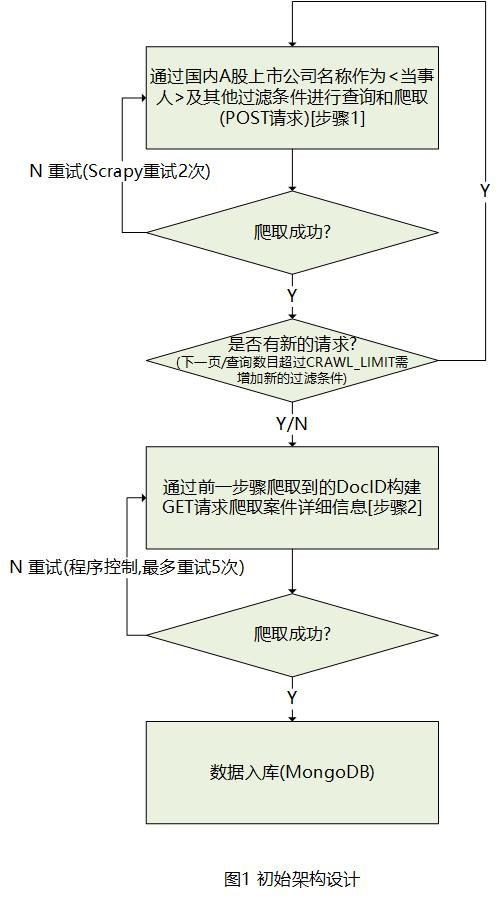
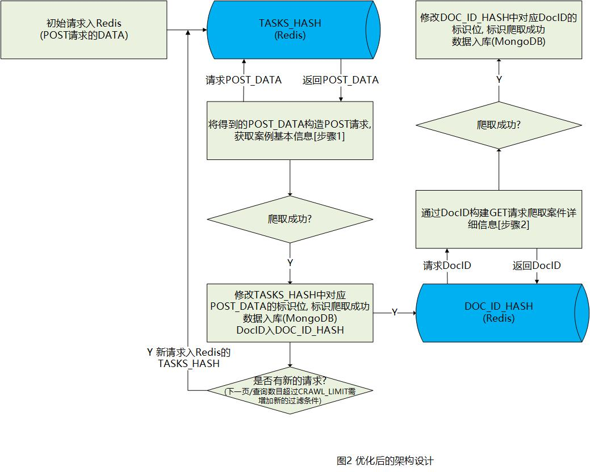

-20170624更新------------------------------------------------------------------------------------------------------------------  
由于中国裁判文书网(China Judgements Online)网站在2017.6.16日（6.15日还能正常爬取）改版了， 所有的请求必须使用`Cookie`，否则得到的都是乱码。而且还必须使用IP代理，否则很容易被封（访问速度会变得特别慢，基本无法使用，改版前，输入验证码即可解封，现在似乎黑名单里的IP封禁更严格了，访问速度一直很慢，而且基本无法正确抓取到数据）。  
此外，网上有那种通过[破解URL构建的文章](https://www.baidu.com/s?ie=utf-8&f=8&rsv_bp=0&rsv_idx=1&tn=baidu&wd=MmEwMD&rsv_pq=a946daa600170532&rsv_t=a2e4ZIBkHtjRBdKzRtr%2BCqvexLUQmC9%2FpIpVHdl2LweHrBMmgq%2B58afEKHw&rqlang=cn&rsv_enter=1&rsv_sug3=2&rsv_n=2)，但感觉太复杂了，所以没有细看。  
因此，我现在采用的策略是先得到Cookie， 然后加上Cookie去请求就能够正确获取到数据了。  
总结一下就是两点：1.必须使用Cookie 2.必须使用IP代理  
详细实现请参见[这里](https://github.com/hee0624/fintech_spider/blob/master/Spiders/CJOSpider/CJOSpider_wo_scrapy_new.py).

------------------------------------------------------------------------------------------------------------------------------
本文是针对最近一个月写的中国裁判文书网(China Judgements Online)的数据爬取代码的总结, 具体代码请参见[CJOSpider on Github](https://github.com/hee0624/fintech_spider/tree/master/Spiders/CJOSpider).
### 一、抓取思路
中国裁判文书网(China Judgements Online)的数据爬取过程主要包括两个步骤:   
**1.爬取案件的基本信息(尤其是DocID)**  
http://wenshu.court.gov.cn/List/ListContent?MmEwMD=1ludmxrjoB4YuPbh570cnpZTOfM6dAf19m2fT0AjkKB3rSkan1uIC0GG0tcYJycJZsoCViUB6USu8gUZiSHik66RvDg2ajSnvuPILVLopaNTOMP7iFm24CxKM0G.kotRU.9ryhc0dWbSW09PfPeBya5Myom9Mr85dt74kLTggN2qafVpiuN.tdwuxe1YPo0rO5zzd6jtrwYETO08.QR4bIM5k68QoPRPpC0tsxmur04zMFiFBxIWJXjUaS8GgYaXXqIGpluooABmztqzkJvlfbJ6Hobwsy9JOtUiM.QnfwK0cqRaqTlNaGgJtg6FHytKTZGfXJFTmwjSmRXcmqYX5FG7Pqt81847ALxu_ehEd6Pzh2tOi4tafV49HhlkrLJtmtJ (链接无法直接访问)   
最初想通过构造上面的URL来爬取, 阅读Assets/js/Lawyee.CPWSW.List.js和Assets/js/Lawyee.CPWSW.ListLoad.js, 发现其中应该包含URL的构建代码  
但后来发现**直接访问"http://wenshu.court.gov.cn/List/ListContent", 并以POST的形式提供上面的5个参数就可以实现抓取**  

> POST  
"Param": "案件类型:刑事案件",  
"Index": 5,  
"Page": 20,  
"Order": "法院层级",  
"Direction": "asc",  

**关键点1: 更加全面地获取到数据**   
如果通过网页操作, "中国裁判文书网"最多只允许浏览前25页的数据(第26页往后的数据无法查看), 每页最多20条案例数据, 也就是最多只能爬取25 \* 20 = 500条案例数据.   
通过POST请求的方式进行爬取, 可以获取前100页的数据, 每页最多20条, 也就是最多只能爬取100 \* 20 = 2000条案例数据.   
因此, 为了**尽可能快速、全面地爬取到所有的数据**, 首先应该采用POST请求的方式进行爬取, 而不是selenium等通过页面操作的方式; 然后, 在POST请求的基础上, 需要将当前请求的案例查询结果的数量控制在2000以下(超过2000条的部分无法获取到) 设置常量CJOSpider.CRAWL_LIMIT为2000.

**具体的思路如下:**   
本次数据爬取的需求是只爬取与国内A股上市公司相关的案例数据, 因此将公司名称(简称/全称)作为"当事人"的过滤条件, 以控制POST请求的案例查询结果的数量在CJOSpider.CRAWL_LIMIT以内.
+ 1)以公司名称(简称/全称)作为"当事人"过滤条件进行爬取
+ 2)若1)中的"当事人"超过CJOSpider.CRAWL_LIMIT，则再按照"案件类型"进行过滤("当事人"+"案件类型")
+ 3)若2)中的"案件类型"超过CJOSpider.CRAWL_LIMIT，则再按照"法院层级"进行过滤("当事人"+"案件类型"+"法院层级")
+ 4)若3)中的"法院层级"超过CJOSpider.CRAWL_LIMIT，则再按照"日期"(每年/每月/每天)进行过滤("当事人"+"案件类型"+"法院层级"+"日期")
每年: 裁判年份:2017    每月/每天: 裁判日期:2017-05-01 TO 2017-05-31/裁判日期:2017-05-01 TO 2017-05-01
+ 5)若4)中的"日期"超过CJOSpider.CRAWL_LIMIT，则再按照"文书类型"进行过滤("当事人"+"案件类型"+"法院层级"+"日期"+"文书类型")
+ 6)若5)中的"文书类型"超过CJOSpider.CRAWL_LIMIT，则再按照"审判程序"进行过滤("当事人"+"案件类型"+"法院层级"+"日期"+"文书类型"+"审判程序")

爬取案件的基本信息以及构建各个过滤条件的代码实现, 请参见[Spiders/CJOSpider/CJOSpider/spiders/CJOSpider.py](https://github.com/hee0624/fintech_spider/blob/master/Spiders/CJOSpider/CJOSpider/spiders/CJOSpider.py)

**2.爬取案件的详细信息**  
通过步骤1得到案件的DocID后, 需要根据DocID构造URL http://wenshu.court.gov.cn/CreateContentJS/CreateContentJS.aspx?DocID=69f56346-9ac8-4361-bdd9-8a1a40918234 以获取案件的详细信息(GET请求即可)   
爬取案件的详细信息的代码实现, 请参见[Spiders/CJODocIDSpider/CJODocIDSpider/spiders/CJODocIDSpider.py](https://github.com/hee0624/fintech_spider/blob/master/Spiders/CJODocIDSpider/CJODocIDSpider/spiders/CJODocIDSpider.py)

### 二、架构设计与优化
**1.最初的架构设计**  
最初的爬取架构如图1所示.

图1中的爬取架构主要存在以下两个问题  
+ 爬取成功率低
 中国裁判文书网网站爬取难度大的主要体现在以下几个方面：
 1. 频繁访问 IP会被禁掉, 出现验证码(还好,禁掉5分钟左右就自动解禁了; 手动输入验证码后可以立即解禁), 因此必须要使用IP代理
 2. 网站的响应速度慢、获取响应的成功率低  
 个人认为, 裁判文书网的响应速度慢和获取响应的成功率低是整个数据爬取实现中最难的部分:  
 响应速度慢要求使用速度快的代理, 否则会存在超时的问题(即使不超时, 也会使得爬取所需要的时间周期非常长);  
 获取响应的成功率低要求爬虫代码必须增加重试机制(scrapy自带的重试次数等设置, 无法保证一定能够得到响应), 但重试机制会进一步导致爬取的速度太低.  
+ 效率问题  
 步骤1和步骤2是串行进行的  
 只有先执行步骤1得到DocID后, 才能根据DocID构造URL进行步骤2, 并且为了尽可能提高数据的爬取成功率, 在进行步骤2时, 会让其最多重试5次, 以尽可能获取到案件的详细信息. 如果5次都没有获取到, 则只能通过后续查MongoDB数据库再去补全(效率太低，需要编写新的代码爬取详细信息并不断读写数据库)

显然通过这种架构进行爬取会使得**爬取速度和成功率都很低**(爬取速度每分钟约2条案例数据; 成功率没有进行统计, 但步骤1一旦请求失败,就必须通过日志或者通过数据库爬取成功的排查出哪些POST请求失败了, 比较麻烦而且很难实现自动化), 因此需要对该架构进行优化

**2.优化架构设计20170531**  
如最初的架构设计所存在的问题(爬取速度慢、爬取成功率低), 因此针对这两个方面对爬虫的架构设计进行优化, 优化后的架构如图2所示.

在图2的架构中, 通过步骤1获取到每个案例的基本信息后，将各个字段入MongoDB, 并且将DocID字段入Redis(**去重、消息队列**); Redis中的DocID作为步骤2的输入, 以获取案例的详细信息.  
优化后的架构与最初的架构主要有以下优势:  
+ 所有的爬取请求均从Redis中获取
步骤1的POST请求是通过Redis的TASKS_HASH中存储的值构建的; 步骤2的GET请求是通过Redis的DOC_ID_HASH中存储的DOC_ID构建的. 并且请求成功/请求失败都会在Redis中添加相应的标志位, 从而实现**断点续爬**.  
Redis的`TASKS_HASH`和`DOC_ID_HASH`的标志位设计说明如下:  
 1)`TASKS_HASH`中的字段值(fields)是各个POST请求的数据部分, 对应值(values)的格式为left_right  
  > **left:**  
  0: 初始值, POST请求还没有发出去  
  大于等于1: 重试的次数(多次请求失败,重复请求的次数)  
  -1: 请求成功,成功爬取到不小于1个案例  
  -2: 请求成功,爬取到0个案例(请求对应的案例数为0)  
  -3: 请求成功,无效爬取(count > CRAWL_LIMIT),需要添加新的过滤条件  
  **right:**  
  0: 初始值, 当前请求还没有真正的发出去  
  timestamp: 当前请求最近一次真正发出去的时间  

  2)`DOC_ID_HASH`中的字段值(fields)是各个案件的DocID, 对应值(values)是一个标志位  
   > 0: 初始值, 未爬取  
   -1: 爬取成功  
   大于0: 上次爬取的时间戳  

  通过将所有的请求放到Redis中既能够防止同一数据的重复请求(均请求成功), 又能够实时监测请求的状态(请求成功、请求失败、请求失败的次数等), 而且还能够实现**断点续爬**(只要Redis中的数据不丢失, 可以随时终止程序, 然后重新运行程序并继续从断点处进行爬取)  
+ 步骤1和步骤2并行、异步爬取
把获取案例基本信息的POST请求(步骤1)和详细信息的GET请求(步骤2)分开, 进行异步爬取, **能够显著提高数据爬取的速度**:步骤1请求成功了直接将数据入MongoDB并将DocID入Redis; 步骤2从Redis中读取DocID,然后爬取其对应的案件详情, 存入MongoDB. 步骤1和步骤2是完全独立并行爬取的, 互不影响. 此外, 只要在Redis中存在没有得到响应的请求(通过标志位判断), 这些请求会一直循环处理(超时后循环处理), 直到请求成功得到响应(**显著提高了数据爬取的成功率**).

使用改进后的架构, 能够保证把所有需要的案例数据全部爬取到(查询结果数量在CJOSpider.CRAWL_LIMIT以内), 从而**提高了案例的整体爬取成功率**. **爬取速度提升了13倍(从2条/分钟提升为26条/分钟)**.

"中国裁判文书网"网站的爬取速度瓶颈主要体现在网站本身的响应速度慢, 使得抓取速度只能依靠多线程来提速(线程数目主要受限于IP代理的个数)
